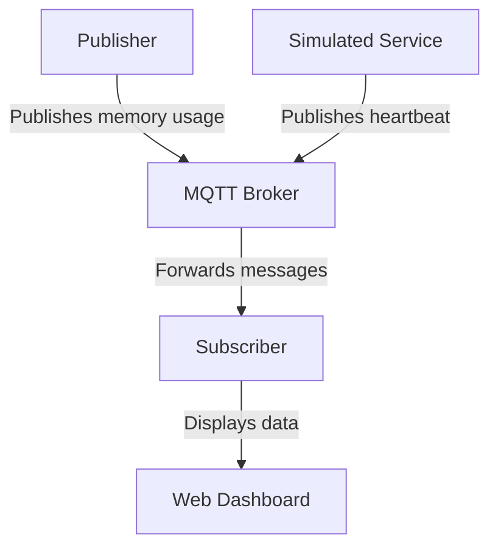

# MQTT Docker Setup

This project demonstrates a simple MQTT setup using Docker. It includes a Mosquitto MQTT broker, a publisher that sends memory usage data, a subscriber that displays the data on a web dashboard, and a simulated service that sends heartbeat messages.

## Running the Project

1. Clone the repository:
   ```sh
   git clone https://github.com/shams3049/mqtt-docker-setup.git
   cd mqtt-docker-setup
   ```

2. Build and start the Docker containers:
   ```sh
   docker-compose up --build
   ```

3. Open your web browser and navigate to `http://localhost:5001` to view the dashboard.

## Process Diagram

Below is a process diagram illustrating the workflow of the MQTT Docker demo:



## Components

### Mosquitto MQTT Broker
- An open-source MQTT broker used to handle the communication between the publisher, subscriber, and simulated service.

### Publisher
- A Python script that publishes memory usage data to the MQTT broker every 5 seconds.

### Subscriber
- A Flask web application that subscribes to the MQTT broker and displays the received data on a web dashboard.

### Simulated Service
- A Python script that simulates a service by publishing heartbeat messages to the MQTT broker.

## Tests

### Running Tests

To run the tests for this project, you can use the following command:

```sh
pytest
```

The tests are located in the `tests` directory and cover the publisher, subscriber, and simulated service components.

## GitHub Actions Workflow

This project includes a GitHub Actions workflow to automatically run tests and linting on push and pull requests. The workflow file is located at `.github/workflows/test.yml`.

The workflow performs the following steps:
1. Checks out the repository.
2. Sets up Python 3.9.
3. Installs dependencies.
4. Runs tests using `pytest`.

You can view the status of the workflow in the "Actions" tab of the GitHub repository.
